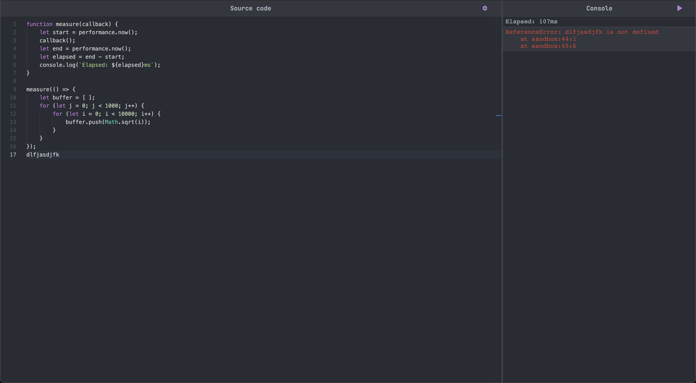

# Just Code
The best way to prototype with JS.
Don't worry with setting up an environment, HTML, CSS... You **Just code**

## Motivation
I was tired of having to code in the DevTools console.
I was tired of experimenting different Javascript playgrounds that never really suited my needs, and the only one that somewhat did was paid (Yeah I'm talking about you [Playcode](https://playcode.io/)!!)

I fell in love with [Quokka.js](https://quokkajs.com/), but it ran on top of node, not ideal if the idea is using browser APIs.

The philosophy of JustCode, as the name suggests, is to provide an environment that you can.... JustCode, being simple and straightforward enough to run in a browser. Making use of the same engine as Visual Studio: Code does!

## Used in this project

| Name | Description |
| -- | -- |
| [Webpack](https://webpack.js.org/) | Packs all the JavaScript files into app.bundle.js |
| [FontAwesome](https://fontawesome.com/) | Cool icons. Even the favicon is from them! |
| [Monaco editor](https://microsoft.github.io/monaco-editor/) | The heart of VSCode, and now... JustCode as well |
| [VM Browser polyfill](https://github.com/snanovskyi/vm-browser) | Not used anymore, but serves as inspiration for [evaluator.js](./src/evaluator.js) |
| [Monaco themes](https://github.com/brijeshb42/monaco-themes) | Providing beautiful color themes for the editor |
| [Monaco theme converter](https://github.com/Nishkalkashyap/monaco-vscode-textmate-theme-converter) | For converting VSCode themes |
| [One Dark Pro](https://github.com/Binaryify/OneDark-Pro) | The theme used in the editor |